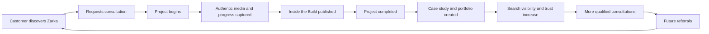

# Zarka Construction Operating System Master Roadmap

> Every feature must either help a customer make a confident hiring decision or
> help Zarka Construction deliver a better project. If it does neither, it does
> not belong.

> Every completed project should make the next customer more confident in hiring
> Zarka Construction.

This is the canonical long-term product roadmap for Zarka Construction. It is a
business roadmap expressed through software, not a software roadmap searching
for a business purpose. Future briefs, implementation plans, and feature
requests must remain consistent with this document or record an explicit
founder-approved decision changing it.

## Current state

| Area | Current state |
| --- | --- |
| Brand position | Golf Simulator Construction Specialist |
| Production | Live at <https://www.zarkaconstruction.com> |
| Public website | Operational |
| Consultation system | Operational and durable |
| Private consultation photos | Operational |
| Founder authentication | Operational and production-verified |
| Founder consultation dashboard | Operational |
| Project management | Operational |
| Inside the Build | Operational; first public Build live |
| Field Mode | Operational and founder-verified on Android |
| Portfolio | Not yet populated |
| Active projects | Two; names intentionally omitted from the public repository |
| Business stage | Transitioning from marketing website to operational platform |
| Roadmap maturity | Phase 3 operational refinement - 4/10 |

The existing consultation and dashboard systems provide valuable foundations.
They do not yet manage the full project lifecycle, so their presence does not
move the business past Phase 0 in this reset roadmap.

## The business flywheel



Accessible sequence:

1. A customer discovers Zarka Construction.
2. The customer requests a consultation.
3. A qualified project begins.
4. Authentic project media and progress are documented.
5. Approved work is shared through Inside the Build.
6. The project is completed.
7. The project produces a case study, portfolio proof, and reusable education.
8. Search visibility and customer trust improve.
9. More qualified consultations and referrals follow.
10. The next project creates stronger proof and repeats the cycle.

The website, dashboard, database, and future field tools support this loop. The
completed work and the confidence it creates are the real products.

## Feature decision gate

Every proposed feature must answer these questions:

1. Does it improve the customer experience or hiring confidence?
2. Does it improve founder operations or project delivery?
3. Does it improve documentation?
4. Does it improve proof?
5. Does it improve scalability without weakening quality or trust?

A feature does not qualify merely because it is technically interesting. It
must satisfy the North Star, identify a concrete business outcome and owner,
define privacy/security/failure behavior, and belong in the current phase.

### Classification rules

- **Build now:** Phase 1 only, after its implementation plan is approved. This
  roadmap commit authorizes no production functionality.
- **Build later:** Valuable features whose dependencies or operating evidence do
  not yet exist.
- **Never build:** Features that conflict with Zarka's identity, authenticity,
  trust, or focused operating model.

Later-phase numeric targets will be set at phase kickoff from measured baselines.
The business outcomes and evidence gates in this roadmap are mandatory now;
invented long-range vanity numbers are not.

## Top five priorities

1. Define project lifecycle, visibility, consent, rights, and publication rules.
2. Establish the private project, update, and media system of record.
3. Give the founder a safe draft, approval, publish, correction, and unpublish
   workflow.
4. Create public active-project pages and Inside the Build from approved data.
5. Prove that authentic project media can become completion evidence, a case
   study, portfolio proof, and future customer confidence.

## Intentionally postponed

Field Mode, daily dashboard expansion, site controls, portfolio scale,
educational marketing, operational automation, CapProof/Bid Desk integration,
proposals, change orders, broader roles, customer access, service workflows,
business intelligence, and AI assistance remain later-phase work. Their place in
the vision is not permission to build them before their dependencies and phase
exit gates are satisfied.

## Data ownership

Once a project exists, it becomes the canonical operational source:

```text
Consultation
└── Project
    ├── Stages
    ├── Updates
    ├── Original media
    ├── Published media
    └── Completion record
        ├── Final gallery
        ├── Case study
        ├── Portfolio entry
        ├── Educational content
        └── Social and marketing assets
```

- A consultation remains linked provenance; it is not copied into uncontrolled
  records.
- Operational facts, original media, internal notes, exact addresses, customer
  contact information, costs, contracts, and private schedules remain private.
- Public pages use an explicitly approved publication representation rather
  than reading private operational records directly.
- Published media remains traceable to its private source, consent, rights, and
  approval decision.
- Unpublishing removes public access without destroying the operational record.
- Case studies, portfolio entries, guides, and social assets derive from the
  project instead of becoming competing sources of truth.
- Future integrations exchange stable project identifiers and documented data;
  they do not silently create parallel truth.

## Desired long-term architecture

| System | Responsibility | Boundary |
| --- | --- | --- |
| Public website | Positioning, education, project proof, conversion | Reads approved public content only |
| Consultation system | Qualified inquiry, room context, optional private photos | Existing server-validated durable intake |
| Projects | Operational project source, stages, status, responsibilities | Private and founder-authorized |
| Inside the Build | Draft, approval, publish, correction, and unpublish | Public-first editorial goal; approval-gated data |
| Media | Private originals, approved public derivatives, captions, rights | No public access to operational storage |
| Portfolio | Completed-project proof and case studies | Derived from approved project records |
| Field Mode | Fast mobile capture and field updates | Same application first; PWA before native app |
| Founder dashboard | Consultations, projects, daily work, controls | Server-authorized, no public data leakage |
| Business settings | Bounded messaging, SEO, availability, featured work, brand | Native founder controls, not a general CMS |
| Integrations | CapProof, Bid Desk, proposals, notifications, later services | Explicit adapters, observable failures, replaceable providers |

Private records remain protected by least privilege, server authorization, RLS,
private caching, and PII-minimized logs. Broader roles require a separate access
model, MFA decision, audit trail, and founder approval before implementation.

## Phase specification matrix

This matrix makes every phase decision-complete at the roadmap level. Detailed
feature tables, business measures, and exit evidence follow.

| Phase | Purpose and business value | Technical scope | Dependencies | Future considerations | Success and exit evidence | Recommended order |
| --- | --- | --- | --- | --- | --- | --- |
| 0 — Operating Foundation | Establish trustworthy discovery and durable inquiry operations | Public site, consultation persistence, private photos, founder Auth/dashboard | Launch providers, domain, security, founder verification | Maintain foundations; do not hide later features here | Production and founder workflow verified | Complete: launch → persistence → dashboard → Auth |
| 1 — Projects and Inside the Build | Turn active delivery into organized operations and proof | Projects, updates, media, publication, public pages | Lifecycle, consent, rights, redaction, retention, additive security plan | Preserve seams for Field Mode; no customer accounts or auto-publishing | Two current projects documented; 25 approved photos; one live sequence and project-to-proof cycle | Rules → private source → media/drafts → approval/publication → completion proof |
| 2 — Field Mode | Make jobsite documentation natural and reliable | Mobile capture, stages, voice notes, PWA; offline only after proof | Phase 1 data/media model and real field observation | Native app and background sync remain evidence-gated | One complete project uses Field Mode with no known lost photos | Online mobile flow → media/stages → voice → PWA → offline decision |
| 3 — Founder Dashboard | Create one actionable operating view | Today, upcoming work, consultations, updates, quick actions, health, simple analytics | Reliable project/field data and repeated daily decisions | No decorative charts, forecasting, or employee views without need | Founder uses it through a full project cycle without a competing tracker | Observe decisions → summaries → unified views → actions → measured signals |
| 4 — Site Controls | Keep approved public information current without code | Bounded settings for homepage, SEO, availability, features, messaging, brand | Stable publishing, repeated changes, preview and rollback | Headless CMS only if native controls prove insufficient | Routine changes completed safely with preview, validation, and rollback | Inventory changes → typed controls → preview → guarded publish |
| 5 — Portfolio | Turn completed work into durable hiring evidence | Case studies, galleries, comparisons, education, later search/filtering | Completed approved projects, rights, consistent completion facts | Add filters only when content volume creates a real problem | Two factual stories and first proof-referenced qualified inquiry | Completion template → initial portfolio → measure use → expand discovery |
| 6 — Marketing | Use real expertise to create qualified demand | Articles, guides, lead magnets, GBP/social support, media library | Sustainable portfolio, repeated questions, ownership, attribution | Paid media, sequences, and auto-posting remain evidence-gated | Sustainable cadence and one asset that produces or assists a qualified inquiry | Mine questions → create proof-backed content → measure → expand channels |
| 7 — Operations | Remove proven handoff and follow-up failures | Consultation conversion, archive, notifications, reminders, audit, templates | Proven manual workflow, stable lifecycle, retention, ownership | No generic CRM, accounting system, or broad campaigns | No lost handoff through a full cycle; actions and changes traceable | Map handoffs → conversion → archive/audit → targeted reminders → templates |
| 8 — Business Growth | Support larger opportunities without duplicate work or overstated authority | CapProof/Bid Desk adapters, proposals, changes, warranties, verified expansion | Stable operations, contracts, approvals, licensing/warranty facts, demand | Accounting/payroll and full-facility management stay separate by default | Each activated capability proves value on a real project | Pick one measured problem → pilot → verify → expand |
| 9 — Long-Term Capabilities | Support a larger organization and longer customer relationship | Crew, subcontractors, portal, service, maintenance, BI, analytics, AI | Real users, mature permissions, clean data, support ownership | Each item is independent; native apps/automation remain optional | Each program has adoption, security, support, and business evidence | Validate one user/problem → secure pilot → measure burden/value |
| 10 — Sustainable Business Platform | Sustain a business flywheel that compounds proof and confidence | Governed operation of proven earlier capabilities; no fixed feature bundle | Adopted workflows, recovery, export, security, ownership, measurable value | Providers may change; principles and accountability remain | Lead-to-referral loop works without fragmented systems or avoidable workarounds | Improve the weakest proven flywheel point; do not manufacture scope |
## Phase 0 — Operating Foundation

**Status:** Complete
**Maturity:** 1/10
**Estimated complexity:** Complete; historically Extra Large
**Purpose: Establish a trustworthy public presence and durable consultation
foundation.

### Business value

Zarka can be discovered, understood, contacted, and trusted with room details.
The founder can securely review durable inquiries and private photos without
relying on email as the system of record.

### Delivered scope

- Simulator-specialist public positioning and production website.
- Responsive, accessible public experience and factual SEO.
- Durable Supabase consultation records and private optional photographs.
- Turnstile, validation, rate limiting, Resend notifications, and truthful
  failure behavior.
- Founder-only consultation dashboard with secure password authentication.

### Exit evidence

Production, canonical redirects, indexing, inquiry persistence, private storage,
email delivery, founder login, cross-tab sessions, sign-out, tests, and security
boundaries are verified. Phase 0 is closed.

## Phase 1 — Projects and Inside the Build

**Classification:** Build now
**Estimated complexity:** Large
**Purpose:** Turn real project execution into organized operations and authentic
customer-facing proof.

### Business value

Customers can see how Zarka thinks and works while projects are active. The
founder gains a governed project record, organized photography, and a repeatable
path from construction progress to case study and portfolio.

### Features

| Feature | Decision | Why |
| --- | --- | --- |
| Projects | Build now | Creates the operational source for work after consultation |
| Inside the Build | Build now | Converts authentic progress into trust while work is active |
| Public project pages | Build now | Gives customers a stable place to follow approved work |
| Project publishing | Build now | Makes publication deliberate, reversible, and accountable |
| Project updates | Build now | Preserves progress and the story behind completed work |
| Project photography | Build now | Creates proof and prevents media from becoming scattered |
| Project media management | Build now | Organizes originals, captions, purpose, rights, and selection |
| Private/public publishing workflow | Build now | Keeps operations private while supporting public-first storytelling |
| Automatic consultation-to-project conversion | Build later, Phase 7 | Manual creation is safer until project workflow is proven |

### Publishing rules

- Active-project storytelling is the editorial default, not automatic public
  database visibility.
- Construction must have begun before a project becomes public.
- Customer/property consent and media rights must be recorded first.
- The founder explicitly activates each public project page.
- Every update begins as private and requires founder approval to publish.
- No upcoming secured project is public merely because it is planned.
- Safe public labels replace exact addresses and unapproved customer identities.
- Published content supports correction and unpublish without deleting history.

### Dependencies

- Approved project lifecycle and status vocabulary.
- Consent, media-rights, public-name, and location-redaction rules.
- Original-media retention, backup, and recovery policy.
- Founder-owned project photography.
- Additive data/security plan reviewed before any migration.

### Business success

Success is not a finished Projects screen. Success means:

- both current active projects are documented;
- at least 25 useful, rights-approved project photographs are organized;
- at least one active Inside the Build sequence is public;
- at least one customer receives and uses the public project-update experience,
  without requiring an account or subscription;
- at least one completed project produces a factual case study and portfolio
  entry;
- no private operational information reaches a public page.

### Exit criteria

Do not begin Phase 2 until:

- one current project completes the full project-to-proof lifecycle;
- both current projects contain usable documentation;
- draft, approval, publish, correction, and unpublish are proven;
- founder-owned photography works across project, case-study, portfolio, and
  marketing contexts;
- the founder uses the workflow in real operations and confirms it is better
  than scattered files or manual publishing.

### Recommended implementation order

1. Approve lifecycle, consent, rights, naming, redaction, retention, and
   publication rules.
2. Design and review additive project/update/media boundaries, RLS, storage,
   cleanup, recovery, and rollback.
3. Build private founder project management.
4. Add media organization, captions, and private update drafts.
5. Add approval-gated public pages and Inside the Build.
6. Add completion, case-study, and portfolio derivation.
7. Verify accessibility, responsive behavior, security, performance, recovery,
   Preview behavior, and Production rollout.

### Future considerations

Do not add customer accounts, subscriptions, live jobsite tracking, automatic
publishing, or a CMS. Preserve seams for Field Mode and later operational
conversion without building them early.

## Phase 2 — Field Mode

**Classification:** Build later
**Estimated complexity:** Extra Large
**Purpose:** Make documentation fast enough to happen naturally at the jobsite.

### Features

| Feature | Decision | Why |
| --- | --- | --- |
| Mobile-first field interface | Build later | Projects must exist before field workflows have a destination |
| Fast photo capture | Build later | Reduces lost evidence and end-of-day sorting |
| Stage updates | Build later | Connects documentation to actual project progress |
| Voice notes | Build later | Reduces field typing while retaining founder review |
| PWA | Build later | Provides installation without premature native-app complexity |
| Home-screen installation | Build later | Makes the field workflow readily available |
| Offline strategy | Build later after online proof | Offline queues are complex and require measured connectivity need |

### Dependencies

Phase 1 project/media model, reliable mobile browser capture, upload recovery,
privacy-safe device behavior, and real field-use observation.

### Business success

- Field Mode is used on every active project workday during one complete project
  cycle.
- Every active project is documented through the governed workflow.
- No known project photos are lost or stranded in personal camera rolls.
- Project updates originate at the jobsite.
- The founder installs and uses the PWA from the phone home screen.

### Exit criteria

Do not begin Phase 3 until one complete project is documented through Field
Mode, online capture is reliable, failures are recoverable, and the workflow is
faster than the founder's prior process. Add offline queuing only when measured
connection failures create real operational loss.

### Recommended implementation order

Mobile task analysis → compact online field interface → camera/media flow →
stage updates → voice-note handling → PWA/installability → measured offline
decision.

## Phase 3 — Founder Dashboard

**Classification:** Build later
**Estimated complexity:** Medium
**Purpose:** Give the founder one trustworthy view of what requires attention.

### Features

| Feature | Decision | Why |
| --- | --- | --- |
| Operational overview | Build later | Requires project and field data first |
| Today's work | Build later | Should reflect real scheduled/active work, not guesses |
| Upcoming projects | Build later | Depends on a proven project lifecycle |
| Consultation summary | Build later | Extends the existing dashboard without replacing it |
| Recent updates | Build later | Becomes valuable after Inside the Build is active |
| Quick actions | Build later | Must emerge from repeated founder tasks |
| Simple analytics | Build later | Only metrics tied to operating decisions belong |
| Project health | Build later | Requires agreed factual signals and ownership |

### Business success and exit criteria

The dashboard must become the founder's normal operating starting point through
a complete active-project cycle. Core information must be accurate without a
competing manual tracker, quick actions must cover repeated work, and health
signals must produce timely action rather than decorative charts. Numeric usage
targets are set from the Phase 3 kickoff baseline.

### Recommended implementation order

Observe daily decisions → define actionable summaries → unify consultations and
projects → add recent/upcoming views → add proven quick actions → introduce only
decision-relevant health and analytics.

## Phase 4 — Site Controls

**Classification:** Build later
**Estimated complexity:** Large
**Purpose:** Let the founder manage bounded public-business settings safely.

### Features

| Feature | Decision | Why |
| --- | --- | --- |
| Business settings | Build later | Centralizes verified operational facts |
| Homepage management | Build later | Useful after publishing cadence is proven |
| SEO controls | Build later | Needs guardrails against inaccurate or duplicated metadata |
| Booking availability | Build later as messaging/configuration | A scheduling platform is outside the product identity |
| Featured projects | Build later | Depends on approved project publishing |
| Public messaging | Build later | Must retain scope and claim controls |
| Brand assets | Build later | Supports approved replacement and governance |
| General-purpose CMS | Never by default | Adds unrestricted complexity without a demonstrated owner/workflow |

### Business success and exit criteria

The founder can complete routine approved changes without code, while preview,
validation, approval, publish, rollback, claim protection, and asset safety are
proven. A separate CMS remains deferred unless measured content volume makes the
native controls insufficient.

### Recommended implementation order

Inventory recurring changes → define typed settings → add preview/validation →
add guarded publishing/rollback → move only proven controls out of code.

## Phase 5 — Portfolio

**Classification:** Build later
**Estimated complexity:** Large
**Purpose:** Turn completed work into the strongest possible hiring evidence.

### Features

| Feature | Decision | Why |
| --- | --- | --- |
| Completed projects | Build later | Requires completed, approved project sources |
| Case studies | Build later | Explain decisions, constraints, work, and outcomes factually |
| Before/after comparisons | Build later | Powerful only when authentic and consistently framed |
| Educational content from projects | Build later | Converts real decisions into useful customer guidance |
| Project search | Build later when volume warrants | Search should solve a real discovery problem |
| Filtering | Build later when volume warrants | Empty or trivial filters weaken the experience |

### Business success and exit criteria

At least two factual project stories are published, the first qualified inquiry
explicitly references project proof, and portfolio facts remain derived from
projects. Search/filtering activates only after measured content volume creates
a browsing problem. Phase 6 waits until portfolio production is sustainable.

### Recommended implementation order

Approve completion template → derive case-study data → publish initial portfolio
→ measure customer use → add comparisons/education → add search/filtering only
when justified.

## Phase 6 — Marketing

**Classification:** Build later
**Estimated complexity:** Large
**Purpose:** Use accumulated expertise and proof to create qualified demand.

### Features

| Feature | Decision | Why |
| --- | --- | --- |
| Educational articles | Build later | Should answer questions observed in consultations/projects |
| Room planning guides | Build later | Reinforces Zarka's strongest differentiator |
| Lead magnets | Build later | Require a defined follow-up and privacy model |
| Google Business Profile integration | Build later | Depends on verified business facts and platform capability |
| Social publishing support | Build later | Approved drafts/exports reduce work without auto-posting risk |
| Media library | Build later | Becomes valuable after project media volume grows |

### Business success and exit criteria

A sustainable publishing cadence exists, and at least one content asset either
produces an attributable qualified inquiry or materially assists a consultation.
Numeric acquisition targets are set from actual traffic and inquiry baselines.
Do not enter Phase 7 because content exists; enter when the content workflow
produces business value without weakening project delivery.

### Recommended implementation order

Mine repeated customer questions → create project-backed guidance → establish
measurement and consent → publish consistently → add lead capture/social/GBP
support only where ownership is clear.

## Phase 7 — Operations

**Classification:** Build later
**Estimated complexity:** Extra Large
**Purpose:** Remove proven handoff and follow-up failures from the business.

### Features

| Feature | Decision | Why |
| --- | --- | --- |
| Consultation-to-project conversion | Build later | Must follow a proven manual project workflow |
| Project archive | Build later | Requires lifecycle and retention rules |
| Notifications | Build later | Must be actionable, observable, and non-noisy |
| Reminder system | Build later | Should address measured missed actions |
| Audit history | Build later | Supports accountability as access and automation grow |
| Document templates | Build later | Valuable after repeated documents stabilize |

### Business success and exit criteria

Accepted consultations move into projects without re-entry or lost context, no
active handoff is lost during a complete project cycle, reminders result in
timely action, and significant operational/publication changes are explainable.
The result remains a focused construction workflow, not a generic CRM.

### Recommended implementation order

Map handoffs → implement explicit conversion → formalize archive/retention → add
audit history → add targeted notifications/reminders → template only stable,
repeated documents.

## Phase 8 — Business Growth

**Classification:** Build later
**Estimated complexity:** Extra Large
**Purpose:** Extend proven operations into higher-value commercial and business
workflows without overstating present authority.

### Features

| Feature | Decision | Why |
| --- | --- | --- |
| CapProof integration | Build later | Valuable only through an explicit, owned handoff |
| Bid Desk integration | Build later | Must reduce duplicate estimating/scope work |
| Proposal workflow | Build later | Requires stable scope and approval practices |
| Change orders | Build later | Requires authoritative approvals and audit history |
| Warranty tracking | Build later | Requires verified warranty terms and service ownership |
| Builder-license expansion | Build later after verification | Software cannot precede legal/operating authority |
| Commercial enhancements | Build later | Must reflect actual specialty scope and customers |

### Business success and exit criteria

Deliver Phase 8 as separate capability releases. Each selected integration or
workflow must be proven on at least one real project, reduce duplicate work or
improve documentation, preserve founder approval, and have observable failure
and rollback behavior. Unused potential features do not block the next useful
capability, but no feature ships merely to complete the list.

### Recommended implementation order

Measure duplicate work → choose one integration/workflow → define ownership and
contract → pilot on one project → verify business value → expand deliberately.

## Phase 9 — Long-Term Capabilities

**Classification:** Build much later
**Estimated complexity:** Multi-program / XXL
**Purpose:** Support a larger organization only after the business actually
requires broader participation and service operations.

### Features

| Feature | Decision | Why |
| --- | --- | --- |
| Crew support | Build much later | Requires real users, roles, training, and support |
| Subcontractor coordination | Build much later | Requires contractual and access boundaries |
| Customer portal | Build much later | Must reduce friction enough to justify support/security |
| Service scheduling | Build much later | Belongs only with a proven service operation |
| Maintenance tracking | Build much later | Requires recurring maintenance responsibility |
| Business intelligence | Build much later | Depends on trustworthy historical data |
| Analytics | Build much later beyond current basics | Must answer defined business decisions without PII leakage |
| AI assistance | Build much later and founder-gated | Drafting aid only; never autonomous authority |

### Business success and exit criteria

Each capability needs a proven user, owner, security/privacy model, support
model, and measurable outcome. Broader access requires role-based authorization,
MFA consideration, least privilege, and auditability. Phase 9 is never delivered
as a speculative monolith.

### Recommended implementation order

Validate one user/problem → define permissions/support → pilot narrowly →
measure adoption and burden → retain, revise, or remove before the next program.

## Phase 10 — Sustainable Business Platform

**Classification:** Long-term maturity benchmark
**Estimated complexity:** Continuous business maturity, not a release estimate
**Purpose: Describe a construction business that runs smoothly and compounds
trust, not a final software release.

Success means:

- the lead-to-referral lifecycle is governed and measurable;
- every completed project produces reusable proof;
- the founder can run core operations without fragmented systems or undocumented
  workarounds;
- public trust and private operations reinforce one another;
- integrations remain replaceable and observable;
- data ownership, recovery, access, retention, and audit practices are
  sustainable;
- the platform supports the construction business instead of becoming the
  business.

## Things we will never build

| Feature or direction | Decision | Reason |
| --- | --- | --- |
| General multi-tenant SaaS platform | Never build | Zarka's system serves its construction business |
| Online simulator/equipment store | Never build | Zarka builds environments and does not position as a dealer |
| Generic CRM | Never build | Focused lead/project operations are sufficient |
| Standalone scheduling platform | Never build | Availability or service workflows do not justify a platform identity |
| Contractor marketplace | Never build | Conflicts with the specialist relationship and operating model |
| Social network | Never build | Does not improve project delivery or hiring confidence |
| Unrestricted public signup | Never build | Accounts require a defined customer/crew need and controlled invitation |
| Custom password store | Never build | Managed identity remains responsible for credentials |
| Raw field auto-publishing | Never build | Private operations and founder approval must remain separate |
| Stock or AI-generated project proof | Never build | Authenticity is central to trust |
| Public operational database access | Never build | Public content must use an approved publishing boundary |
| Autonomous AI pricing, scoping, contracts, or commitments | Never build | Founder accountability and factual authority cannot be delegated |

## Strategic blind spots to resolve before Phase 1

1. Customer/property-owner consent and photography/model releases.
2. Public project names, safe location labels, and identity redaction.
3. Project status, stage, completion, and publication vocabulary.
4. Original-media ownership, retention, backup, restore, deletion, and storage
   cost.
5. Publication correction, takedown, and withdrawal procedures.
6. Founder workload and a sustainable update cadence.
7. Project disaster recovery and export outside a single provider.
8. Future crew/subcontractor roles, MFA, least privilege, and audit history.
9. Accessibility and performance as project media grows.
10. Licensing, permit, warranty, insurance, and commercial-scope language.
11. Baselines for inquiry quality, documentation completeness, publication
    consistency, portfolio-assisted conversions, and referrals.

These are planning gates, not permission to invent public facts. Phase-specific
implementation planning must resolve the relevant item before code or migration
work begins.

## Roadmap governance

- Finish a phase's exit criteria before beginning the next phase's general
  scope. A critical security, legal, or operational repair may interrupt.
- A later-phase idea may be researched early but not implemented early without
  a founder-approved ADR explaining why sequencing changed.
- Each phase begins with an implementation brief, data/privacy review, rollback
  plan, test plan, and measurable baseline where required.
- Each phase ends with real-business use, not merely a successful deployment.
- Update this document, `docs/ROADMAP.md`, `docs/DECISIONS.md`, and `progress.md`
  whenever strategy, sequencing, or phase status changes.
- If a feature does not strengthen hiring confidence or project delivery, reject
  it even if it appears elsewhere on an old wish list.

## Phase 1 implementation status — August 5, 2026

**Status:** Implementation begun on `main`; exit criteria not yet achieved.

The project/update/media schema, founder project workspace, publication workflow, public Inside the Build routes, direct private media upload, and conditional homepage feature are implemented. New records remain private. Mason Simulator Environment and Social Golfer Simulator Environment are not seeded or published automatically.

Technical deployment does not complete Phase 1. Exit still requires real operating use: founder-created Builds, approved authentic photography, published progress, and proof that a completed project can feed the portfolio/case-study flywheel. Phase 2 remains blocked until those outcomes are demonstrated.

## Phase 2 operating note - August 6, 2026

Phase 1 Projects and Inside the Build is operational, including the first public Albatross Golf Mason Build. Phase 2 Field Mode has begun as an online-first PWA. Software completion does not satisfy the Phase 2 exit gate: the founder must use it during active work, document every relevant capture, avoid lost photos, and collect real failure evidence before offline synchronization is reconsidered.

## Phase 3 status - Founder Mission Control

**State:** Implementation and production verification in progress.

Mission Control replaces the former two-count admin landing page with bounded operational summaries, actionable review queues, active and upcoming Builds, publication work, consultation state, derived recent activity, quick actions, and safe provider-availability indicators. Reliable metrics come from Supabase operational records. Vercel page views are deferred because there is no approved application-side reporting interface in the current integration.

### Phase 3 success criteria

- The founder can identify the most important next action from `/admin` without opening multiple areas.
- Active and upcoming Builds match the operational records.
- Candidate photos, unpublished updates, notification failures, and incomplete captures surface only when actionable.
- Founder navigation, Field Mode, and public Build stories share a calm, precise interaction system.
- Private/public boundaries and Field Mode speed remain unchanged.

### Phase 3 exit criteria

Do not move to Phase 4 Site Controls until the founder confirms Mission Control is accurate and useful on desktop and Android, Field Mode remains fast, public Build pages feel intentionally editorial, and no privacy or performance regression is present.

## Inside the Build editorial transition — August 6, 2026

Inside the Build has moved from functional project publication to a premium editorial journal. Public updates are presented as Milestones; photographs are intentionally grouped and ordered; planned and actual dates are distinct; publication permission is recorded; and only metadata-stripped public derivatives may be rendered. Founder-selected cover and social images replace automatic image choice.

The project remains the single source. Completion may later yield a case study, portfolio presentation, or planning guide, but those products remain derived views rather than parallel truth. Comments, likes, profiles, subscriptions, sharing mechanics, and social-style engagement remain intentionally deferred. The software should recede behind clear documentation, authentic photography, and confidence in the work.
## Phase 3.5 status — Premium Build Sharing

Inside the Build adds a restrained distribution layer between editorial proof and future consultation. Public Build cards offer View the Build and Share. Build detail pages offer native Share, Copy Link, Post to X, and the existing Build-context consultation path. Canonical URLs come from trusted site configuration; no private identifiers or deployment hostnames enter sharing.

This does not change the product into a social platform. Comments, likes, followers, public counts, profiles, notifications, subscriptions, Meta APIs, and analytics infrastructure remain excluded. Site Controls remain Phase 4 and do not begin as part of Phase 3.5.